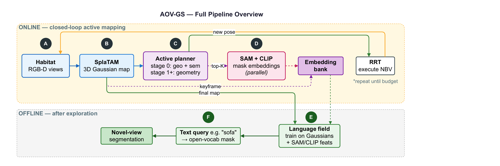
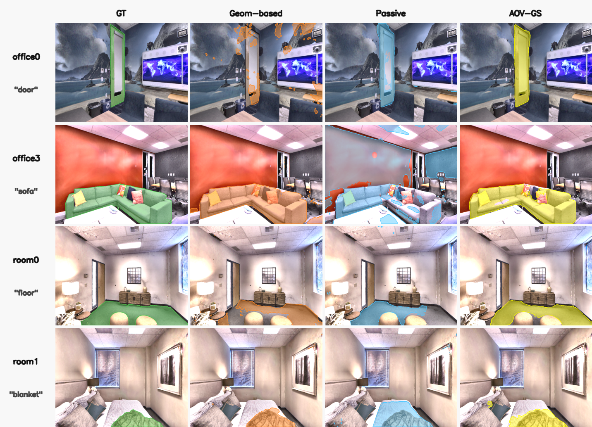
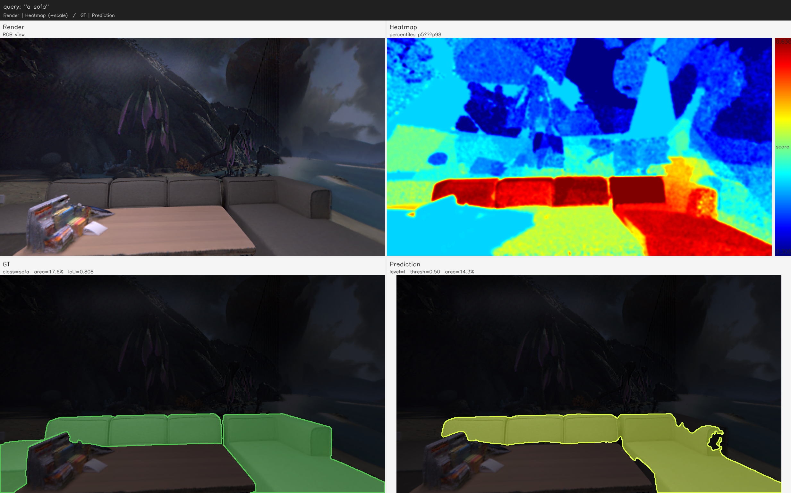
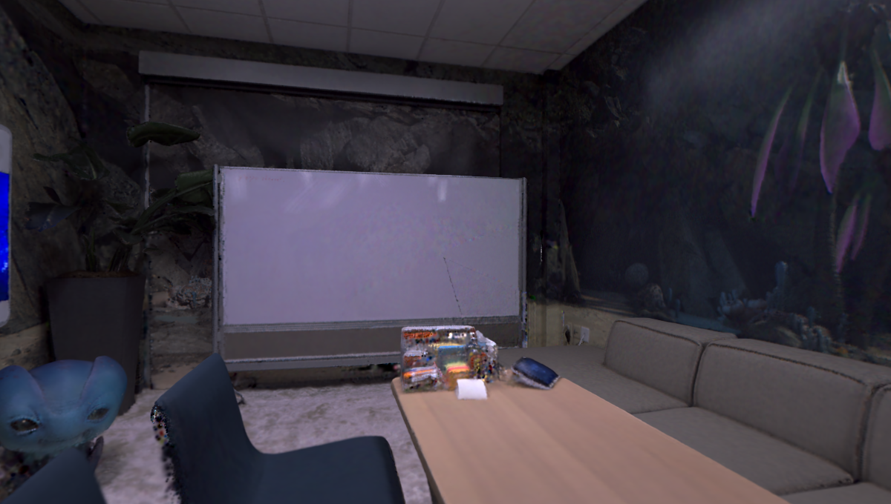

# AOV-GS — Active Open-Vocabulary 3D Gaussian Splatting

**Exploring while Grounding: Open-Vocabulary Active Mapping with 3D Gaussian Splatting**

Standalone project: active scene exploration (**SplaTAM**), SAM+CLIP feature collection, and an **open language field** (LangSplatV2 / legacy LangSplat).

Repository: [github.com/OptimusFaber/AOV-GS](https://github.com/OptimusFaber/AOV-GS)

<p align="center">
  
</p>

<p align="center"><em>Online active mapping (Habitat → SplaTAM → planner) and offline open-vocab language field.</em></p>

<p align="center">
  
</p>

<p align="center"><em>Novel-view language masks: GT (green) · Geom-based (orange) · Passive (blue) · AOV-GS (yellow).</em></p>

<p align="center">
  
  
</p>

<p align="center"><em>Left: text query <code>"a sofa"</code> (render / heatmap / GT / prediction). Right: RGB render from the Gaussian map.</em></p>

---

## Contents

1. [Quick start](#quick-start)
2. [Documentation](#documentation)
3. [`third_parties/`](#third_parties)
4. [Main commands](#main-commands)
5. [GPU and CUDA](#gpu-and-cuda)
6. [NVS and validation](#nvs-and-validation)
7. [Repository structure](#repository-structure)
8. [Licenses](#licenses)

---

## Quick start

```bash
git clone --recursive https://github.com/OptimusFaber/AOV-GS
cd AOV-GS

bash scripts/installation/quick_start.sh
```

The `quick_start.sh` script runs step by step:

1. `third_parties/` — git submodules / auto-clone (~200 MB)
2. conda environment `aov-gs` (~12 GB)
3. pip: open_clip, segment-anything, scikit-learn
4. SAM checkpoint → `ckpts/sam_vit_b_01ec64.pth` (~400 MB)
5. Replica + Habitat + NVS data

**Disk space:** plan for **≥ 30 GB** free (conda ~12 GB, Replica and derived data ~7–17 GB, remainder ~1 GB).

Options: `--skip-env`, `--skip-data`, `--skip-sam`, `--yes` (no confirmation). Details: `bash scripts/installation/quick_start.sh --help`.

**Docker** (alternative to local conda):

```bash
bash docker/build.sh
bash docker/run.sh
```

Details: [docker/README.md](docker/README.md).

If you cloned **without** `--recursive`:

```bash
bash scripts/installation/setup_third_parties.sh
```

After installation:

```bash
conda activate aov-gs
# legacy: active-gs / active-sgm are also picked up by the scripts
# next — scripts/aov-gs/README.md
```

---

## Documentation

| Topic | File |
|------|------|
| Pipeline 01–03, batch, **GPU** | [scripts/aov-gs/README.md](scripts/aov-gs/README.md) |
| Conda, HPC, quick start | [scripts/installation/README.md](scripts/installation/README.md) |
| Replica / NVS data | [scripts/data/README.md](scripts/data/README.md) |
| `third_parties/` | [third_parties/README.md](third_parties/README.md) |
| Docker | [docker/README.md](docker/README.md) |

---

## `third_parties/`

Dependencies (~200 MB): Co-SLAM, SplaTAM, neural_slam_eval, channel rasterizers.

**No need** to copy manually from other repositories:

```bash
git clone --recursive https://github.com/OptimusFaber/AOV-GS
# or after a regular clone:
bash scripts/installation/setup_third_parties.sh
```

**`habitat_sim`** (~5 GB) is not stored in git — it is installed via conda (`build_sem.sh`).

Check:

```bash
test -f third_parties/coslam/utils.py && \
test -f third_parties/splatam/utils/slam_external.py && echo OK
```

---

## Main commands

See [scripts/aov-gs/README.md](scripts/aov-gs/README.md).

```bash
# Full open-vocab
bash scripts/aov-gs/pipeline_gs_open_vocab.sh office0

# Step by step
bash scripts/aov-gs/01_slam_exploration.sh office0 ActiveOpenSem 0 0 0
bash scripts/aov-gs/02_validate_features_langsplatv2.sh results/Replica/office0/ActiveOpenSem/run_0
bash scripts/aov-gs/03_train_gaussian_lang_field_langsplatv2.sh \
  results/Replica/office0/ActiveOpenSem/run_0 64 s 30000 cuda:0 1 4 auto 1.0
```

Results: `results/Replica/<scene>/<EXP>/run_N/`.

---

## GPU and CUDA

Quick cheat sheet. Details: [scripts/aov-gs/README.md § GPU](scripts/aov-gs/README.md#gpu-and-cuda).

| What | Where to set | Default |
|-----|-------------|---------|
| Visible GPUs | `GPU` / `CUDA_VISIBLE_DEVICES` | `01_*.sh`: `GPU=0,1` |
| SplaTAM | `primary_device` in `replica_splatam_s.py` | `cuda:0` |
| SAM + CLIP | `sam_clip.device` in `ActiveOpenSem_base.py` | **`cuda:0`** |
| Lang field train | `DEVICE` in `03_*.sh` | `cuda:0` |
| Python scripts | `--device` | `cuda:0` |

**Two GPUs** (SLAM on 0, SAM on 1): in the config set `sam_clip.device = "cuda:1"`, run `GPU=0,1 bash scripts/aov-gs/01_slam_exploration.sh ...`

**Lang field on GPU 1:** pass `cuda:1` as the `03_*.sh` argument (auto-remap via `_gpu_helpers.sh`).

Override SAM without editing the config: `SAM_CLIP_DEVICE=cuda:1`.

---

## NVS and validation

```bash
python scripts/run_nvs_validation.py \
  --cfg configs/Replica/office0/ActiveOpenSem.py \
  --result_dir results/Replica/office0/ActiveOpenSem/run_0 \
  --stage eval_exploration_stage_1

python scripts/validate_lang_field_traj.py \
  --scene office0 \
  --result_dir results/Replica/office0/ActiveOpenSem/run_0 \
  --traj_txt data/replica_sim_nvs/office0/traj.txt \
  --device cuda:0
```

---

## Repository structure

| Path | Purpose |
|------|------------|
| `assets/` | README figures (pipeline, masks, query demo) |
| `src/main/activesgm.py` | SLAM + SAM/CLIP |
| `scripts/aov-gs/` | pipeline 01–03 |
| `scripts/installation/quick_start.sh` | one-shot install |
| `docker/` | CUDA 11.7 image — build & run |
| `third_parties/` | vendored deps (submodules) |
| `configs/Replica/<scene>/` | scene configs |

---

## Licenses

MIT — see [LICENSE](LICENSE).  
Third-party components (SplaTAM, Co-SLAM, Habitat, etc.) — licenses in the respective repositories / `third_parties/`.
